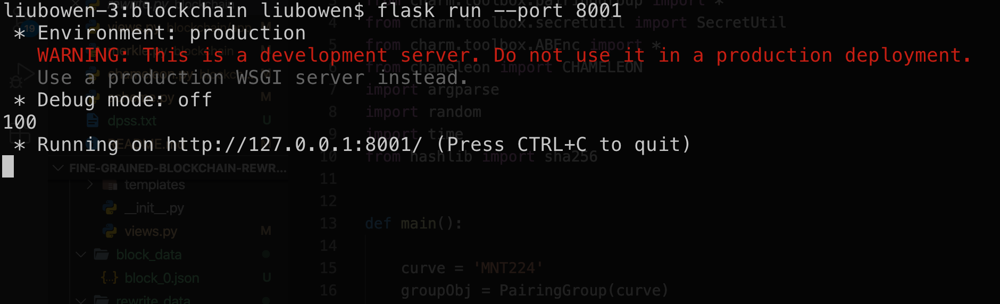
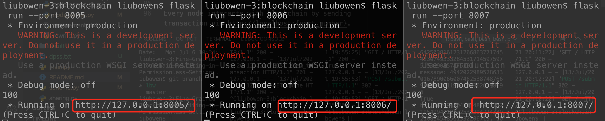
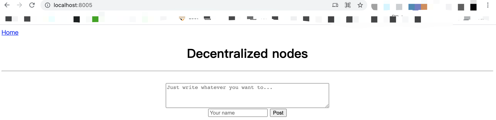
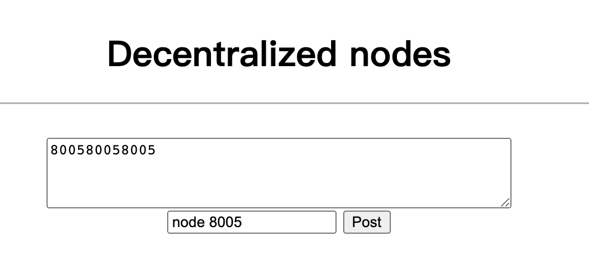
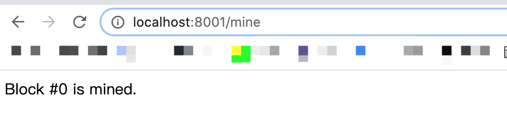
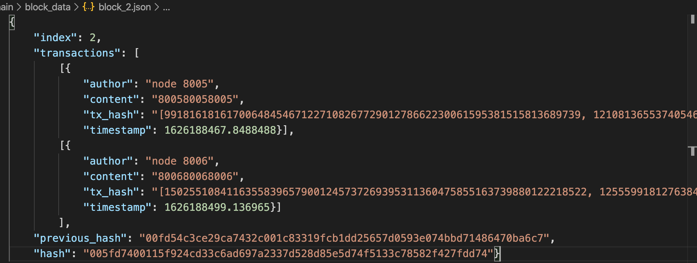
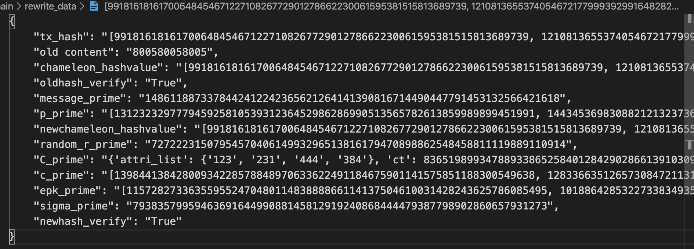

# Fine-Grained-Blockchain-Rewriting-in-Permissionless-Setting

A construction of practical ABET scheme, in addition to a Proof-of-Work blockchain implemented.
The ABET scheme can be used to secure blockchain rewriting, such that trapdoor holder may maliciously rewrite the blockchain without being identified.

## Prerequisites

The schemes have been tested with Python 3.6.7 on Mac OS X. First, verify that you have installed the following dependencies:

- [GMP 5.x](https://gmplib.org)
- [PBC library](https://crypto.stanford.edu/pbc/download.html)
- Charm 0.43, this can be installed from [this](https://github.com/JHUISI/charm/releases) page
- [OpenSSL](https://www.openssl.org/source)

## Overview

The instantiation includes the following primitives: an attribute-based encryption *KP-ABE*,
a hierarch identity-based encryption *HIBE*, a *chameleon hash* with ephemeral trapdoor, a *digital signature* scheme (e.g., Schnorr), a *DPSS* protocol and a running Proof-of-Work *blockchain*.

Some basic details of the implementation are:
```
scheme.py: full code of setup(), keygen(), hash(), verify(), adapt() algorithms
sharing.py: code of DPSS protocol 
blockchain/: code of blockchain with nodes
```

## Instructions to run

Clone the project,

```sh
$ git clone https://github.com/lbwtorino/Fine-Grained-Blockchain-Rewriting-in-Permissionless-Setting.git
```

Once installed all the dependencies, to run and test ABET scheme, 
```sh
$ python main.py ABET
```
The ABET logic is from `scheme.py`, including `setup()`, `KeyGen()`, `Hash()`,`Verify()`
and `Adapt()`.  


You can also seperately run and test DPSS protocol, 
```sh
$ python main.py DPSS
```
The DPSS logic is from `sharing.py`. In the test case, we provide the data shared between 
old committees and new committees (both size includes 5 committee members).
We provide an execution output example in `./dpss.txt`,
where `S` is *secret*, `shares_A` indicates the CommitteeA (old committee)'s shares,
 `reshare_A` denotes the re-shares that should be distributed from CommitteeA to CommitteeB (new committee)
 `shares_B` refers to the shares that CommitteeB re-calculate after receiving shares from CommitteeA,
`recovered_S` means the recovered *secret* from new committee. As shown, it equals to `S`.


## Deploy a blockchain and nodes

Install the dependencies,

```sh
$ cd blockchain/
$ pip install -r requirements.txt
```

Start a blockchain, the port number is set to 8001,

```sh
$ export FLASK_APP=node_server.py
$ flask run --port 8001
```


As shown below, one instance of our blockchain is now up and running at port 8001.



To play around multiple custom nodes, run the blockchain on a different terminal session,
 here's a sample scenario that you might wanna try. 

<!-- ```sh
$ python run_app.py
``` -->
<!-- The application should be up and running at [http://localhost:5000](http://localhost:5000). -->
```sh
$ flask run --port 8005
$ flask run --port 8006
$ flask run --port 8007
......
```
As shown below, now we are deploying three nodes on blockchain.


## Interact with blockchain

Every node interacts with blockchain by sending transaction via http://localhost:{port_number}.
In your browser, type http://localhost:{port_number} (e.g., http://localhost:8005/).
The UI of each node is shown below:
.

To send a transaction to blockchain, type the data and your id and by clicking `Post` button.
.

To mine the transaction, in your browser, type http://localhost:8001/mine.
.

In our construction, each transaction contains the following properties:
```json
{
    "author": transaction creator,
    "content": post_content,
    "chameleon_hashvalue": the hashed value (traditional blockchain generates this field by generic SHA256 hash function while we propose a chameleon hash function that allows to change the content but keep
    the chameleon hash value unchanged, achieving rewrite blockchain),
    "tx_hash": transaction hash
}
```
**[Warning]: Please note that in the upper-layer real-worl blockchain (Merkle tree structure) only saves the hash value of content (i.e., `chameleon_hashvalue`, not saving the `content` itself).
This is actually the objective of our paper. Unlike SHA256 hash, the chameleon hash function we proposed allows *m* and *m'* can generate identical hash value, allowing malicious/curious/authorized roles
to rewrite the blockchain (i.e., the low-layer message `content` can be changed from *m* to *m'* but `chameleon_hashvalue` is unchanged)**

The chain data (transaction details) are saved in `./block_data`. As shown below, 
we give an example with two mined transactions. Please pay attention to the `chameleon_hashvalue`
and `tx_hash`, we may introduce how to rewrite blockchain in the next section.

.


## Rewrite blockchain
In our paper, the objective of blockchain rewriting is: 
in traditional blockchain constructions, the chain data is computed by generic 
SHA-256 hash function, which has uniqueness property. That means *m* and *m'* have different hash value.

In contrast, we propose a new chameleon hash function (refers to `Section 5.2` in our paper)
that allows *m* and *m'* are able to have the same chameleon hash value by performing specific strategy (refers to `Section 5.2` Adapt() method). By doing so, malicious/curious/authorized roles
are able to rewrite the blockchain, as low-layer storage *m* can be replaced to *m'*
but already-stored `chameleon_hashvalue` (stored at upper-layer blockchain's Merkle tree) is unchanged.

We demonstrate how to rewrite each transaction in `./rewrite_data`. Each file contains the
required data for each transaction hash. In previous section,
the two transaction hash are `4df02f684bc9b61acb32a295fb82f53845db5d0895788ba5034cbf23ccbd8123`
and `9288ba41f86b107436c9c25f5478336c77a317c8bd36f07e217bbe670ca5d4d3`.

We provide the example for such two transaction in `./rewrite_data`. Taking 
`4df02f684bc9b61acb32a295fb82f53845db5d0895788ba5034cbf23ccbd8123` as an example (please
also refer to `Section 5.2` of our paper),
.

where `old content` is the posted content by node 8005,  `chameleon_hashvalue`
is the hash value by our proposed chameleon hash function,  
(`message_prime`, `p_prime`, `newchameleon_hashvalue`, `random_r_prime`, `C_prime`,
 `c_prime`, `epk_prime`, `sigma_prime`) are the required output data of `Adapt()` in `Section 5.2` of our paper, and the `newhash_verify` is the `Verify()`.

Please find the process of cryptography correctness in our paper.
For demonstration, you can see that `chameleon_hashvalue` and `newchameleon_hashvalue`
are same but message *m* is from `800580058005` to *m'* `10922750752118515382477482494832258082451427663424270727346752036252`.
Meanwhile, `newhash_verify` is `True` indicating the corretness is verified by `Verify()`.


